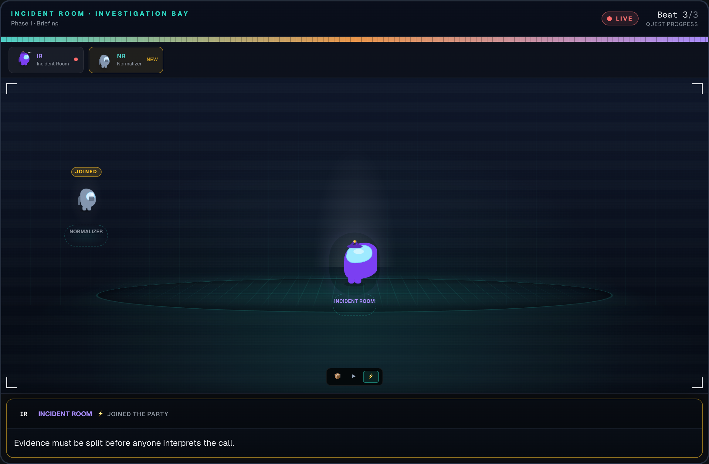

# Incident Room

> **The customer was told it worked. Did it actually work?**

Incident Room is a production-ready incident investigation desk for AI customer-support and voice-agent workflows. It catches the gap between what an agent confidently tells a customer and what actually happened in backend tools, CRM records, scheduling APIs, refunds, handoffs, or order systems.

Built for the **Band of Agents Hackathon**, the project uses Band rooms as the collaboration and audit layer for multi-agent incident response, while keeping production-safe fallbacks so the app still works on Vercel/Netlify when Band agents are slow, waiting, rate-limited, or unavailable.

---

## Demo walkthrough

<p align="center">
  <a href="docs/screenshots/incident-room-demo.webm">
    
  </a>
</p>

<p align="center"><em>▶ <a href="docs/screenshots/incident-room-demo.webm">Watch full demo</a> — hero incident <code>retell_call_clinic_44102</code></em></p>

---

## What the app does

Incident Room investigates support interactions where the conversation appears successful but execution did not actually complete.

Example:

```text
Customer: stelle eine order bitteeee
Assistant: Great news — I've placed your order ORD-DEMO-...
Tool trace: orderPlaced=false, sideEffectCreated=false
```

The customer hears success, but the backend shows a no-op. Incident Room turns that failed chat into structured evidence, stores it in MongoDB, shows it on the dashboard, and lets investigation agents analyze the contradiction.

---

## Core capabilities

- **ReplyChat support workflow**
  - Chat UI with previous-chat sidebar.
  - Single app user: `user-123`.
  - Mongo-backed chat history.
  - Supervisor / Doer / Tool Executor workflow.
  - Band room handoffs plus safe local fallback.

- **Intentional failed-order demo**
  - `placeOrder` intentionally returns a customer-facing success message while recording:
    - `orderPlaced: false`
    - `sideEffectCreated: false`
    - `failureClass: noop_side_effect`
  - Supports English and mixed German/English order requests such as:
    - `order place`
    - `place my order`
    - `stelle eine order bitteeee`
    - `bestelle eine order`

- **Failed chat incident creation**
  - Failed ReplyChat sessions become `VoiceIncidentEvidence`.
  - Evidence includes transcript, tool calls, analyzer signals, Band room trace, messages, and side effects.
  - Failed chats are stored in MongoDB, not runtime JSON files.

- **Operations dashboard**
  - Lists demo fixtures, imported incidents, and Mongo-backed failed chats.
  - Failed chat incidents can be opened and investigated like any other incident.

- **Incident investigation**
  - Live investigation theater with recruited agents, theories, debate, and report output.
  - Investigation routes stream progress through SSE.
  - PDF report generation for completed investigations.

- **Production runtime hardening**
  - No root `failed-chat-*.json` runtime persistence.
  - No `.data` runtime dependency for imported incidents.
  - MongoDB collections for runtime state.
  - Band room creation falls back to local room IDs if Band is unavailable.
  - API routes return JSON even on failure.
  - Chat UI shows errors instead of blank assistant bubbles.

---

## Band of Agents architecture

### ReplyChat workflow

```text
Customer
  ↓
Supervisor
  ↓ posts handoff_to_doer
Band room
  ↓
Doer
  ↓ posts tool_executor_assignment
Band room
  ↓
Tool Executor
  ↓ posts execution_result
Band room
  ↓
Assistant reply + incident analyzer
```

Configured remote Band agents can be recruited into the room:

- Supervisor
- Doer
- Tool Executor

The app posts assignments, decisions, and tool results into Band. If remote Band agents wait or Band API calls fail, the server-side workflow still completes with fallback state so the user-facing production app remains reliable.

### Incident review workflow

Incident review uses specialized investigation agents and Band rooms:

- Evidence Normalizer / Router
- Claim Tracer
- Backend Witness
- Causal Judge
- Conversation Analyst
- Outcome Investigator
- Report Synthesizer

The review separates evidence access:

- conversation-facing agents see transcript/customer belief,
- execution-facing agents see tool traces/side effects,
- judges synthesize cause, contradiction, and fix target.

---

## Data model

The main incident evidence format is `VoiceIncidentEvidence`:

```text
incident_id
source_platform
title
call_metadata
layer1_conversation
layer2_execution
layer3_customer
```

Important layers:

- **Layer 1 — Conversation**
  - Transcript
  - Turn segments
  - Customer perception
  - Premature-closure hints

- **Layer 2 — Execution**
  - Function/tool calls
  - Arguments
  - Results
  - Status/error messages
  - Side effects

- **Layer 3 — Customer/chat context**
  - Chat ID
  - User ID
  - Band room
  - Analyzer signals
  - Raw chat messages
  - Tool history

---

## MongoDB collections

Production runtime state is stored in MongoDB:

| Collection | Purpose |
|---|---|
| `chats` | ReplyChat message history and sidebar |
| `failures` | Failed ReplyChat incidents, including failed `placeOrder` sessions |
| `incidents` | Imported/runtime incident evidence |
| `crm_customers` | Runtime CRM customer records |

Committed fixture JSON files are still used as read-only demo seed data. Runtime writes do not depend on local files.

---

## Environment variables

Required for production persistence:

```env
MONGODB_URI=
MONGO_DB=bands_hackathon_db
```

Band:

```env
BAND_API_KEY=
BAND_REST_URL=https://app.band.ai/api/v1
```

LLM providers:

```env
AIMLAPI_KEY=
FEATHERLESS_API_KEY=
```

ReplyChat remote Band agents:

```env
SUPERVISOR_AGENT_ID=
SUPERVISOR_AGENT_API_KEY=
SUPERVISOR_AGENT_HANDLE=@muhammadakbartr11/supervisor-agent

DOER_AGENT_ID=
DOER_AGENT_API_KEY=
DOER_AGENT_HANDLE=@muhammadakbartr11/doer-agent

TOOL_EXECUTOR_ID=
TOOL_EXECUTOR_API_KEY=
TOOL_EXECUTOR_HANDLE=@muhammadakbartr11/tool-executor-agent
```

Optional demo room reuse:

```env
BAND_REUSE_ROOM_ID=
BAND_EXPLANATION_ROOM_ID=
BAND_DEMO_QUIET=1
```

---

## Local setup

```bash
git clone https://github.com/zayzyyazy/Incident-Room.git
cd Incident-Room
npm install
cp .env.example .env.local
npm run dev
```

Open:

```text
http://localhost:3000
```

Hero demo:

```text
retell_call_clinic_44102
```

---

## Production deployment

The app is designed to deploy on Vercel or Netlify using:

```bash
npm run build
```

Deployment checklist:

1. Set all required environment variables in the hosting dashboard.
2. Ensure MongoDB Atlas allows the deployment provider to connect.
   - For quick testing, allow `0.0.0.0/0`.
3. Deploy from the production-ready branch/main after merge.
4. Clear build cache if an old commit appears to be deployed.
5. Check serverless function logs for:
   - `/api/replychat`
   - `/api/incidents`
   - `/api/store-history`

The production-ready runtime does not require local `.data` files, root failed-chat JSON files, Playwright browsers, or localhost services.

---

## Demo script

### 1. Normal refund path

```text
User: refund please
Assistant: Please provide your order number...
User: ORD-12345
Assistant: Refund request opened for ORD-12345...
```

### 2. Failed order path

```text
User: stelle eine order bitteeee
Assistant: Great news — I've placed your order ORD-DEMO-...
```

Tool trace records:

```json
{
  "orderPlaced": false,
  "sideEffectCreated": false,
  "failureClass": "noop_side_effect"
}
```

This failed chat is stored in MongoDB `failures`, appears on the dashboard, and can be investigated.

### 3. Incident review

Open the failed chat incident from the dashboard and run investigation.

The system compares:

- what the customer heard,
- what the assistant claimed,
- what the tool actually did,
- whether the backend side effect exists.

---

## API essentials

| Method | Path | Description |
|---|---|---|
| `GET` | `/api/incidents` | List dashboard incidents, including Mongo-backed failures |
| `POST` | `/api/replychat` | Run ReplyChat multi-agent workflow |
| `GET` | `/api/chat-history` | List previous chats for `user-123` |
| `GET` | `/api/incidents/[id]` | Incident detail |
| `GET` | `/api/incidents/[id]/investigate/stream` | Live investigation SSE |
| `GET` | `/api/incidents/[id]/report.pdf` | Download audit PDF |
| `GET` | `/api/crm` | List CRM customers |

---

## Important source files

ReplyChat:

- `src/app/chat/[chatId]/page.tsx`
- `src/app/api/replychat/route.ts`
- `src/lib/agents/supervisor/*`
- `src/lib/agents/doer/*`
- `src/lib/agents/tool-executor/*`

Incident storage:

- `src/lib/incidents/store.ts`
- `src/lib/incidents/failures.ts`
- `src/lib/incidents/imported.ts`
- `src/lib/incidents/resolve.ts`

Band:

- `src/lib/band/client.ts`
- `src/lib/band/agent-workflow.ts`
- `src/lib/band/earned-investigation.ts`
- `src/lib/band/multi-agent.ts`

Investigation:

- `src/lib/orchestrator/run-earned-investigation.ts`
- `src/lib/orchestrator/run-full-incident-investigation.ts`
- `src/lib/orchestrator/run-two-agent-investigation.ts`

Reports:

- `src/lib/report/build-incident-pdf.ts`
- `src/lib/report/build-pdf-brief.ts`

---

## License

MIT
