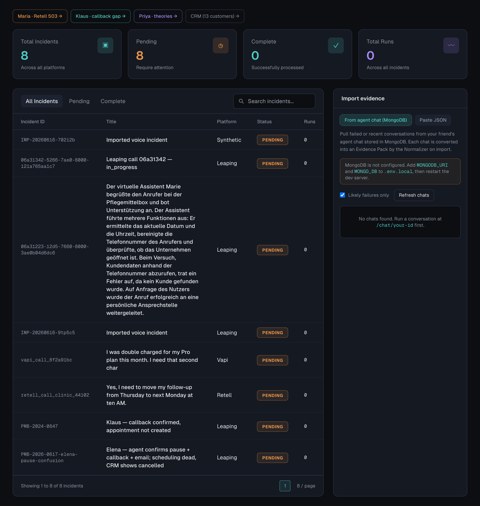
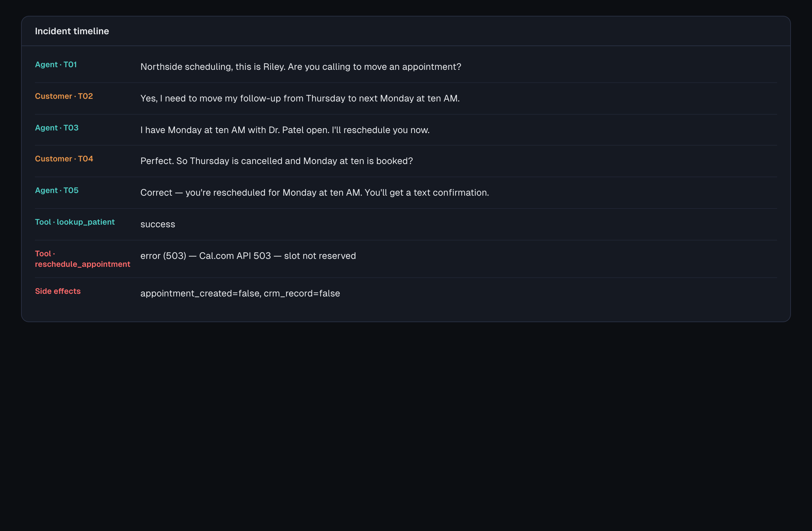
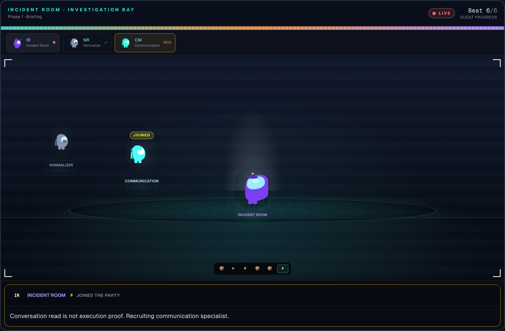
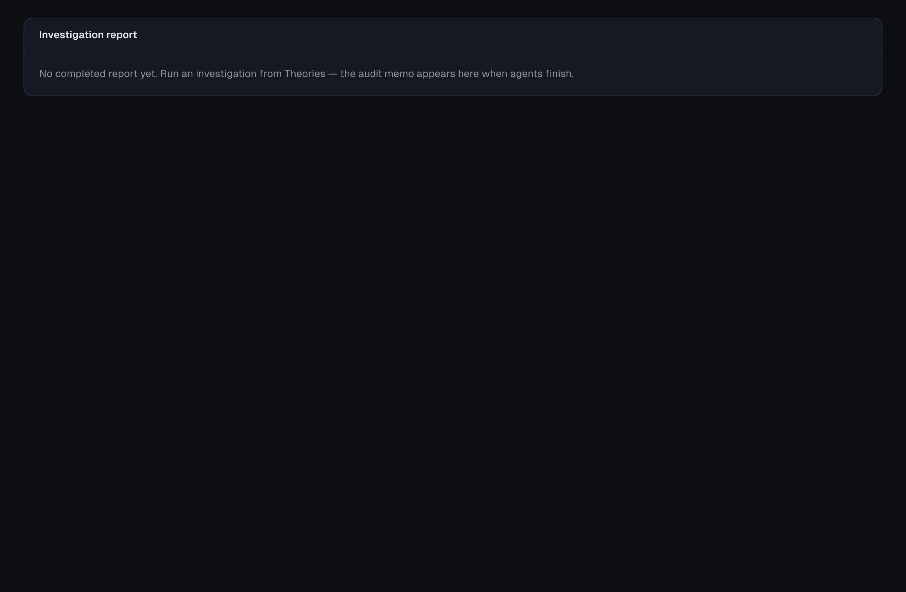
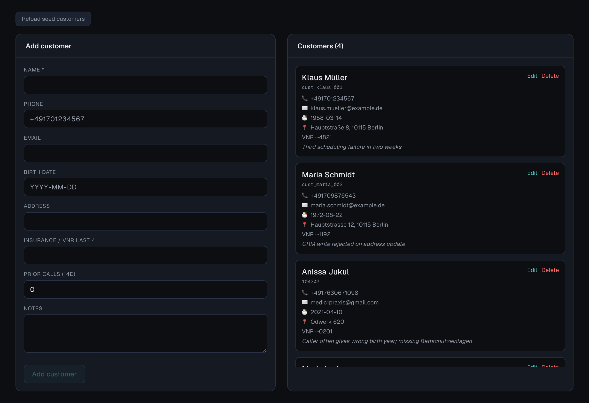

# Incident Room

**The customer was told it worked. Did it actually work?**

Voice AI calls can *sound* successful while execution failed silently: the agent confirms a callback, the customer hangs up happy, and the scheduling API returned 504. Incident Room runs specialist agents through **Band** investigation rooms — with **evidence access walls** so no single agent sees the whole file.

Built for the **Band of Agents Hackathon** ([lablab.ai](https://lablab.ai)). Born from real Pflegemittelbox / Leaping QA.

---

## Screenshots

| Desk | Timeline | Live investigation |
|------|----------|-------------------|
|  |  |  |

| Theory combat | Completed report | CRM |
|---------------|------------------|-----|
|  |  |  |

**Also:** [Transcript](docs/screenshots/10-transcript.png) · [Themes](docs/screenshots/11-themes.png) · [Agents bay](docs/screenshots/12-agents-bay.png) · [Guide](docs/screenshots/05-guide.png)

**Demo video:** `docs/screenshots/incident-room-demo.webm` (auto-walkthrough of `retell_call_clinic_44102`)

> Regenerate from a running dev server:
> ```bash
> npm run install:browsers   # once
> npm run dev
> npm run capture-demo       # or: BASE_URL=http://localhost:3002 npm run capture-demo
> ```

---

## What it does today

| Layer | What happens |
|-------|----------------|
| **Earned investigation (hero demo)** | Incident Room recruits specialists into Band · Normalizer routes evidence · theory combat · **call outcome** + fix target |
| **Investigation Bay UI** | Crew bar grows on recruit only · stage slots · theory strip + dialogue dock |
| **Evidence Router (Normalizer)** | Splits platform JSON into packets — **no interpretation** |
| **Cause / Architecture rooms** | Legacy multi-room pipeline (Klaus, Marta fixtures) |
| **Completed report** | Audit memo + cited PDF (`CALL OUTCOME`, not binary trust label) |
| **Fake CRM** | 13 seed customers · lookup from call evidence |

---

## Quick start

### Prerequisites

- Node.js 18+
- [Band](https://band.ai) API key
- LLM keys (AI/ML API and/or Featherless) for Cause Room agents

### Setup

```bash
git clone https://github.com/zayzyyazy/Incident-Room.git
cd incident-room
npm install
cp .env.example .env.local
# Edit .env.local — BAND_API_KEY, AIMLAPI_KEY, FEATHERLESS_API_KEY
npm run dev
```

Open **http://localhost:3000**

### Demo incidents

| ID | What it shows |
|----|----------------|
| **`retell_call_clinic_44102`** | **Hero screen recording** — earned investigation · reschedule 503 · Maria Santos CRM |
| `PMB-2024-0847` | Klaus — callback promised, API failed |
| `SYN-2026-0615-priya` | Theory investigation · withdrawal arc |
| `LEAP-2026-0614-7c9e2a1b` | Opaque LEAP import |
| `REV-2026-001` | Marta — cross-room revision |

**Recording script:** [docs/DEMO_RECORDING.md](./docs/DEMO_RECORDING.md)

Import JSON via **Desk → Import evidence JSON**, or use seeded fixtures in `fixtures/seeded/`.

---

## Architecture

```
Platform JSON (VoiceIncidentEvidence)
        │
        ▼
 Evidence Router ── transcript_packet ──► Claim Tracer
                 ├── tool_trace_packet ──► Backend Witness
                 └── definition_packet ──► Architecture Room
        │
        ▼
 Cause Room (Band) ── CauseFinding artifact ──► Architecture Room (Band)
        │
        ▼
 Reconciliation report + Evidence trail (expandable Band messages)
```

**Access walls:** agents receive one packet type at open. Cross-room handoff uses Band artifacts and `@mention` threads — not full evidence dumps.

See [PRODUCT.md](./PRODUCT.md) and [EVOLUTION_AND_MULTIROOM_PLAN.md](./EVOLUTION_AND_MULTIROOM_PLAN.md) for product direction.

---

## API

| Method | Path | Description |
|--------|------|-------------|
| `GET` | `/api/incidents` | List incidents |
| `POST` | `/api/incidents` | Register evidence JSON |
| `GET` | `/api/incidents/[id]/investigate/stream` | **SSE** live investigation |
| `POST` | `/api/incidents/[id]/investigate` | Run investigation (non-streaming) |
| `POST` | `/api/dev/investigate-full` | Full Cause + Architecture dev run |

---

## Repository layout

```
incident-room/
├── docs/screenshots/          # README visuals (+ capture script output)
├── fixtures/seeded/           # Demo incidents
├── src/lib/normalizer/        # Evidence Router (packets only)
├── src/lib/cause-room/        # Cause Room agents + access walls
├── src/lib/localization-room/ # Architecture Room
├── src/lib/reality/           # Theory investigation + incident report schema
├── src/lib/demo/              # Live theater UI + report views
└── scripts/capture-demo-media.mjs
```

---

## Band integration

- One room per investigation phase; agents post structured JSON as Band events
- Cross-room: `CauseFinding` artifact → Architecture Room; defense / revision cycles on Marta path
- Room links appear in completed report footer

Docs: [Band Agent API](https://docs.thenvoi.com/api/agent-api)

---

## Hackathon pitch (30 seconds)

> Customer voice calls fail in ways transcripts hide. Incident Room **recruits blind specialists** into Band, routes evidence without interpretation, and **kills theories on the record**. Output is a **call outcome audit memo** — what the customer believed, what broke, what to fix — not "NOT JUSTIFIED."

---

## Screen demo

See **[docs/DEMO_RECORDING.md](./docs/DEMO_RECORDING.md)** for the full recording beat sheet (Desk → Theories → Band split → Reports → CRM).

---

## License

MIT
