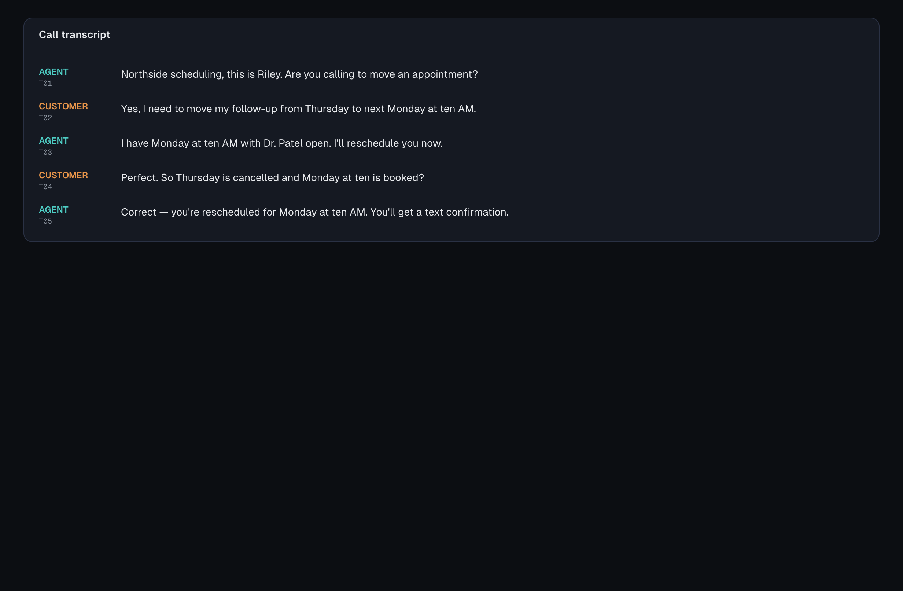
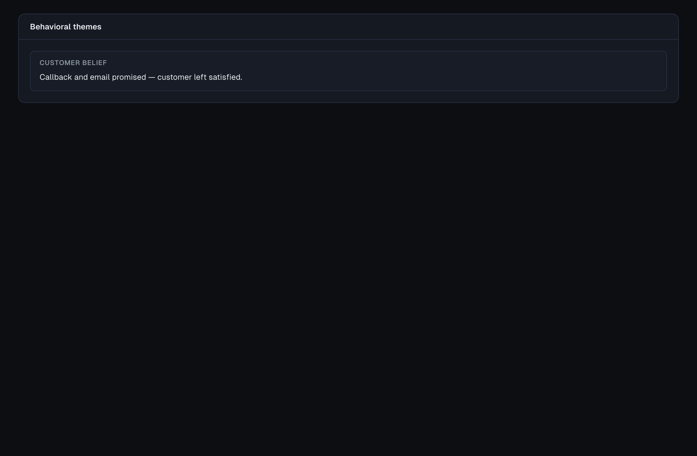
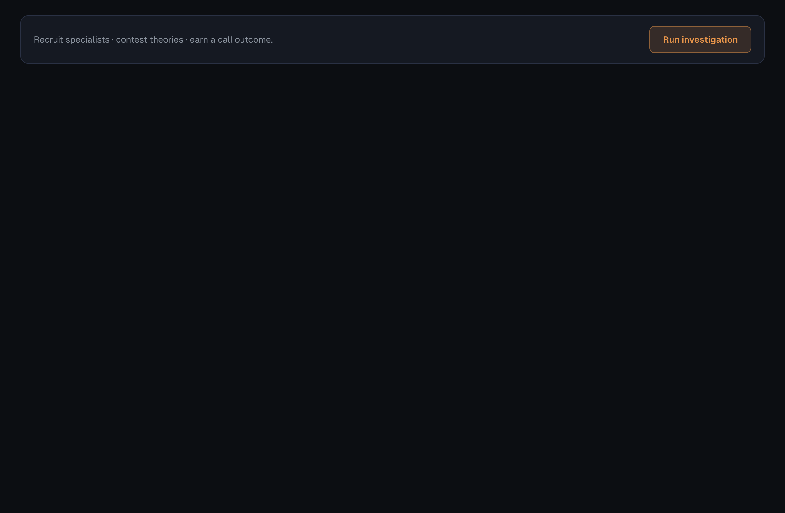
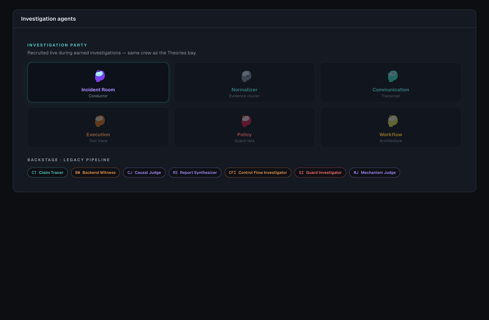
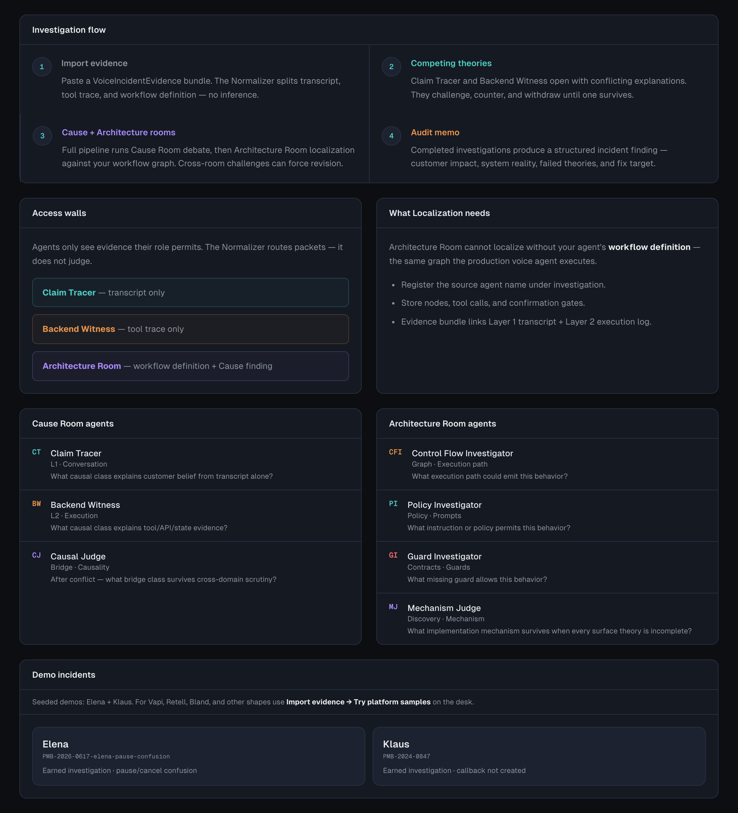

# Incident Room

> **The customer was told it worked. Did it actually work?**

Voice AI calls often *sound* successful while execution fails silently — the agent confirms a reschedule, the customer hangs up happy, and the scheduling API returned **503**.

**Incident Room** is an investigation desk for those calls. Blind specialists join a **[Band](https://band.ai) room** one at a time (each sees only their evidence slice). They recruit on the record, route proof, challenge theories, and produce a **call outcome audit** — what the customer believed, what actually broke, what to fix next.

Built for the [Band of Agents Hackathon](https://lablab.ai).

---

## Demo walkthrough

<p align="center">
  <a href="docs/screenshots/incident-room-demo.webm">
    
  </a>
</p>

<p align="center"><em>▶ <a href="docs/screenshots/incident-room-demo.webm">Watch full demo</a> (hero incident <code>retell_call_clinic_44102</code>)</em></p>

---

## The problem (one call)

**Maria** asks to move a clinic follow-up to Monday 10am. The agent says yes and promises a text. The transcript looks clean.

Then you open the **tool trace**: `reschedule_appointment` → **HTTP 503**. Nothing was booked.

<p align="center">
  
</p>

<p align="center"><em>Timeline — conversation vs. execution on the same screen.</em></p>

---

## Live investigation (Band + UI)

Specialists **recruit into the room** as the screenplay runs — not all at once. The Investigation Bay shows who joined, the active theory, and who agrees or challenges.

<p align="center">
  
</p>

<p align="center"><em>Phase 2 — evidence routing. Normalizer delivers packets; Communication proposes a theory.</em></p>

<p align="center">
  
</p>

<p align="center"><em>Phase 3 — theory combat. Incident Room rejects early close when tool trace was never opened.</em></p>

Matching posts land in **Band** under separate specialist identities (Communication, Execution, Policy, etc.) — not one bot narrating everything.

---

## Output: call outcome, not “NOT JUSTIFIED”

The report answers: **Did the call fail for the customer? What happened? What should engineering fix?**

<p align="center">
  
</p>

PDF export uses **CALL OUTCOME** / **WHAT HAPPENED** sections — audit memo, not a binary trust label.

---

## More views

| | |
|:---:|:---:|
| <br>**Desk** — incidents across platforms | <br>**Transcript** — cited turns |
| <br>**Themes** — customer belief vs reality | <br>**CRM** — customer matched from call evidence |
| <br>**Theories** — start investigation | <br>**Agents** — who was in the party |

<p align="center">
  
</p>

---

## How it works

```
Voice call JSON (transcript + tools + CRM hints)
        │
        ▼
 Evidence Router (Normalizer) ── packets only, no interpretation
        │
        ▼
 Band room ── specialists recruit → speak → challenge theories
        │
        ▼
 Call outcome report + PDF + cited evidence trail
```

**Access walls:** Claim Tracer sees transcript; Backend Witness sees tool trace; no agent gets the full file at open.

---

## Quick start

```bash
git clone https://github.com/zayzyyazy/Incident-Room.git
cd incident-room
npm install
cp .env.example .env.local   # BAND_API_KEY + LLM keys
npm run dev
```

Open **http://localhost:3000** → **`retell_call_clinic_44102`** → **Theories** → **Run investigation**.

| Demo ID | Scenario |
|---------|----------|
| **`retell_call_clinic_44102`** | Reschedule promised · Cal.com 503 · CRM match |
| `PMB-2024-0847` | Callback promised · API never booked |
| `SYN-2026-0615-priya` | Theory / withdrawal arc |

Recording beat sheet: [docs/DEMO_RECORDING.md](./docs/DEMO_RECORDING.md)

Regenerate screenshots + video: `npm run install:browsers` then `npm run capture-demo`

---

## API (essentials)

| Method | Path | Description |
|--------|------|-------------|
| `GET` | `/api/incidents` | List incidents |
| `GET` | `/api/incidents/[id]/investigate/stream` | **SSE** live investigation |
| `GET` | `/api/incidents/[id]/report.pdf` | Download audit PDF |

---

## License

MIT
